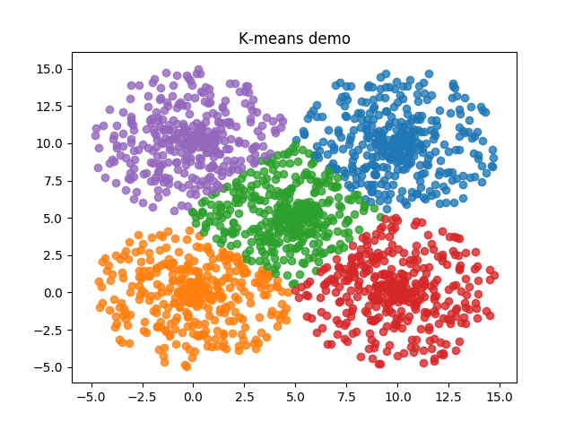

This directory contains example files related to this project.

# File list under the examples directory

## Using NeuralNetwork class
### Basic

| Summary| File name | Note | 
|---|---|---|
| Demo for logical AND operation| neural_network_logistic_regression_example | Neural network logistic regression example code |
| Demo for logical XOR operation| neural_network_xor_example | Neural network logistic regression example code |

### Different Optimizers against MNIST data

| Summary| File name | Note | 
|---|---|---|
| Batch gradient descent| neural_network_mnist_example | Neural network example to identify MNIST digit data using the **batch gradient descent**. Accuracy as of [this rev]( https://github.com/hideyukiinada/ml/commit/5b9e4dca610791d5d9f21dd1890e1a27c3002c2a) is 91.0% against the MNIST test data that contains 10,000 sample data. |
| SGD|neural_network_mnist_sgd_example | Neural network example to identify MNIST digit data using **SGD**. Accuracy as of [this rev]( https://github.com/hideyukiinada/ml/commit/1cfd9bb688b364309c8dda9cabdc41e72c512b7a) is 91.7% with 5 epochs against the MNIST test data that contains 10,000 sample data. |
|SGD with batch size 256|neural_network_mnist_sgd_batch_size_256_example | For SGD & Adam, you can set the batch size to a number greater than 1 and this example shows how to specify that.  |
| Adam optimizer| neural_network_mnist_adam_example | Neural network example to identify MNIST digit data using **Adam**. Accuracy should be around 96% with 2 epochs against the MNIST test data that contains 10,000 sample data. (Tests were executed 3 times on 11/29/2018 and the result was 96.35%, 96.02% and 96.2% respectively) |

### Different Optimizers against Fashion MNIST data

| Summary| File name | Note | 
|---|---|---|
| SGD| neural_network_fashion_mnist_sgd_example | As of [this commit](https://github.com/hideyukiinada/ml/commit/33056cceba92b9b782a1c762c42ab3afa104d5ca), accuracy was __86.15%__. |
| Adam optimizer| neural_network_fashion_mnist_adam_example | |

### Loading & Saving Weights and Biases

| Summary| File name | Note | 
|---|---|---|
|Example to save and load weights for the basic logistic regression | weight_persistence_example | Both weights and biases are saved to a hdf5 file. |
|Example to save and load weights for MNIST | weight_persistence_mnist_example | __You need to run this script to test the web app under web_examples/mnist.__ |

### GAN - Generative Adversarial Network

| Summary| File name | Note | 
|---|---|---|
|GAN demo to generate MNIST-like digit | neural_network_mnist_gan_example | GAN example code. Please see [details](https://github.com/hideyukiinada/ml/blob/master/examples/readme_gan.md) |

### Helper class examples

| Summary| File name | Note | 
|---|---|---|
|Activation functions demo| activation_example | Activation function example code |
|Cost functions demo| cost_example | Cost function example code |

## K-means

| Summary| File name | Note | 
|---|---|---|
|K-means| kmeans_example | An example for k-means clustering with 5 clusters. |

